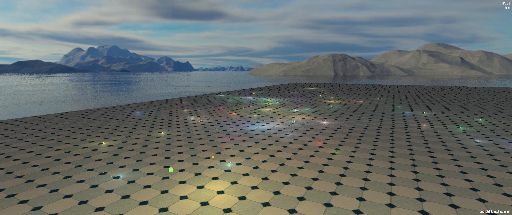

# Particle System

This is for HW1 of the course CSCI 5611 Animation and Motion Planning in Games, UMN.

This is a bunch of multiple implementation of particle systems.

## Features

##### Basic Features

Implementation of Bounce Ball, Fire, Fireworks, Water Fountain.

##### Simulation

+ Fire Simulation using Curl Noise
+ N-body Galaxy Simulation (10,000 particles, 30 FPS)

##### User Interface

+ 3D Implementation of all scenes
+ 3D User Controlled Camera
+ Real-time User Interaction with systems (pause/resume, control acceleration, adjust the amount of particles and ...)
+ Multiple Particle Systems in one scence

##### Hardcore Technology

+ SIMD Implementation using Compute Shader and CUDA (see benchmark part)
+ Thread-Parallel Implementation using OpenMP

##### Benchmark

+ 500, 1000, 10,000, 100,000, 1,000,000, 3,000,000 Particles Benchmark for methods of TransformFeedback, Compute Shader, CUDA and CPU Implementation, and for Instancing Draw and Geometry Shader.
+ N-body Simulation Benchmark for Compute Shader and CUDA (CUDA win)

##### Trivial Tricks

+ Textured and Translucent Particles
+ Particle Trails
+ Collision Detection with external obstcales (no collision detection among particles)

## Gallery

##### Controll

+ `w`, `a`, `s`, `d`: move
+ `q`, `e`: turn left/right
+ `mouse motion`: turn direction
+ `mouse scroll`: zoom in/out
+ `ese`: toggle menu
+ `b`: reset camera
+ `r`: reset scene
+ `p`: freeze scene
+ `z`, `x`: increase/decrease particles

### Lighting Bounce Ball

Video Demo: [click me](https://www.youtube.com/watch?v=uBcT19S4e4E&list=PLNoGwCJv2USFR9DVIukjJIZ5yAyFjtEF0&index=2)

##### Control

+ `left click`: shoot a bounce ball

##### Key Features

+ Deferred Rendering

### Firworks

Video Demo: [click me](https://www.youtube.com/watch?v=DFXW0sZyuig&list=PLNoGwCJv2USFR9DVIukjJIZ5yAyFjtEF0&index=4)

##### Key Features

+ Color Fading
+ Translucent Particles
+ Trails

### Water Fountain

Video Demo: [click me](https://www.youtube.com/watch?v=2Q4pfzkeVqY&list=PLNoGwCJv2USFR9DVIukjJIZ5yAyFjtEF0&index=7)

##### Control

+ hold `←`, `→`, `↑`, `↓`: control wind
+ `m`: reset wind speed

##### Key Features

+ Compute Shader
+ Particles and Obstacle Interaction
+ Particles and User Interaction
+ Transparency Fading
+ Texutred Particles (for transparency)

### Fire

Video demo: [click me](https://www.youtube.com/watch?v=-LN6R0lbDLg&list=PLNoGwCJv2USFR9DVIukjJIZ5yAyFjtEF0&index=5)

##### Key Features

+ Real-time **Curl Noise**-Based Simulation 
+ Compute Shader
+ Color Fading
+ Textured Particles

### Galaxy

Video demo: [click me](https://www.youtube.com/watch?v=xzPO-c6m_1M&index=6&list=PLNoGwCJv2USFR9DVIukjJIZ5yAyFjtEF0)

##### Control

+ `m`: switch computation mode between Compute Shader and CUDA

##### Key Features

+ Real-time N-body Simulation
+ Computer Shader and CUDA benchmark (16,000 vs 100,000 particles to keep 30FPS)
+ Textured Particles (for transparency)

### Benchmark Scene

Video demo: [click me](https://www.youtube.com/watch?v=bKjq2sM-k24&index=7&list=PLNoGwCJv2USFR9DVIukjJIZ5yAyFjtEF0)

##### Control

+ `m`: switch different rendering and computation mod

##### Key Features

+ Benchmark for 3,000,000 particles over 30FPS
+ Computer Shader
+ Geometry Shader
+ Transform Feedback
+ Translucent Particles

## Benchmark

#### Test Environment

    Ubuntu 16.04, G++ 5.4.1, CUDA 9.0, OpenGL 4.5
    Intel i7-7700K, Nvidia GTX1080 Ti with driver 390.25

#### Benchmark I: `glDrawArrays` vs `glDrawArraysInstancing` vs Geometry Shader

In particle systems, particles usually share the same shape, or say the same vertex structure. Therefore, we can utilize `glDrawArraysInstancing` or Geometry Shader to draw all particles at once instead of calling `glDrawArrays` for each particle or storing vertices of all particles.

In our test scene, each particle is a circle with 128 vertices but no texture and drawn by `GL_TRIANGLE_STRIP`. They are shown on the screen using billboard technique with transparency fading. The state update for particles run on CPU parallelly with 8 threads. Each particle has its own velocity and would rotate around a common center point. The update function running on CPU is responsible for updating the position of particles based on their velocity and rotation, and shaders are responsible for computing their positions on the screen using billboard technique.

Measures: FPS

|              Particles | 500 |1000 |2000 |5000 |10,000|50,000|100,000|500,000|1,000,000|
|-----------------------:|:---:|:---:|:---:|:---:|:----:|:----:|:-----:|:-----:|:-------:|
|Multiple `glDrawArrays` |     |     |     |     |      |      |       |       |         |
|`glDrawArraysInstancing`|1100 |1090 | 980 | 878 | 832  | 350  | 190   | 38    | 20      |
|Geometry Shader         |1060 |1020 | 933 | 853 | 707  | 340  | 177   | 36    | 17      |

Basically, `glDrawArraysInstancing` and Geometry Shader have very similar performance. In the case `glDrawArraysInstancing`, the vertex shader has to do computation for each of one primitive's `v` vertices. Assuming that we have `n` primitives, the vetex shader do computation `vn` times. When using Geometry Shader, the most computations are just done once for all vertices of one primitive. Therefore, geometry shader are suggested more computatively effective. However, the introduction of geometry shader makes output vertices unpredictable for the driver. This could result the driver losing the potential to do optimization.  In our test cause, the geometry shader needs to emit 218 vertices for one primitive. In practice, we usually wont emit complex primitives like this. Therefore, the difference between `glDrawArraysInstancing` and geometry shader in practice often is negligible. I recommend to use `glDrawArraysInstancing` unless geometry shader is really needed.

#### Benchmark II: Multi-Thread vs Transform Feedback vs Compute Shader vs CUDA

The test scene is the exactly same with Benchmark I. In the transform feedback case, a vertex shader is used to compute the position update for each particle. Double (ping-pong) buffers are used for transform feedback. In the compute shader test case, a compute shader is used to compute the position update for each particle. In the CUDA test case, a CUDA kernel, whose code is extacly same with the core code of the compute shader, is used. Particles are drawn using `glDrawArraysInstancing`.

|Particles     |10,000|50,000|100,000|500,000|1,000,000|2,000,000|3,000,000|5,000,000|
|-------------:|:----:|:----:|:-----:|:-----:|:-------:|:-------:|:-------:|:-------:|
|1 thread      |994   | 440  | 222   | 40    | 19      |    -    |      -  | -       |
|8 thread      |1014  | 460  | 240   | 44    | 21      |    -    |      -  | -       |
|TF            |970   | 725  | 566   | 180   | 68      |   32    |      27 | 16      |
|Compute Shader|1039  | 630  | 570   | 183   | 98      |   38    |      30 | 20      |
|CUDA          |      |      |       |       |         |         |         |         |

It is very slow to run particle update function on CPU. The first reason is that in most cases we at most only have 6 ~ 32 cores for a CPU and thus the number of threads we can employ from CPU is quite limited compared to those from GPU, which can easily reach 128 to 512 threads for a kernel runing on a single GPU. The second reason is the cost of data transportation between GPU memory and RAM on motherboard. The cost is very considerable for large amount of data. This is why in our test, the 1 thread and 8 thread have limited difference in performance. Becuase most time is occupied by data transportation.

Comparing to Compute Shader and CUDA, who are specializedly designed for SIMD case, Transform Feedback perform not bad. However, due to double buffers, Transform Feedback need much more space for storage. Worse, Transform Feedback has very limited function and is a little complex for implementation comparing to Compute Shader and CUDA. Use Compute Shader and CUDA as possible. 

#### Benchmark III: Compute Shader vs CUDA

There is almost no difference between Compute Shader and CUDA in Benchmark II. However, CUDA has many powerful features that OpenGL compute shader cannot provide, for example, reliable random number generators, many mathematical functions, many special functions, like those to compute FFT and to  sort arrays, and, very important, specially designed memory format.

Here we use the Galaxy Scene for testing. The Galaxy Scene is, in fact, a N-body Simulation. This kind of simulation is a computatively heavy task. We need to compute the gravitation between each pair of bodys. When using the brute-force method, in the single thread mode, for N body, we need to compute the gravitation `n(n-1)/2` times. In multi-thread or SIMD mode, in order to avoid data racing among threads, we usually have to perform computation at least `n(n-1)` times. If `n` is large, we usually directly to do computation `n^2` times for convenience, because the error is quite small for a large `n` and because `n(n-1)` times of `if` check usually is not cheaper than `n` times of computing gravitation.

In the CUDA test case, we utilize the feature of **shared memory** to accelerate computation. On the surface, the introduction of shared memory will cause four times more of memory write, two times of thread synchronization and a few more addition operation for a batch of bodys (the batch is decided by the block dim we run the kernel). However, due to the special design of shared memory, the performance improvement is quite large. 

Meaures: FPS

|    Particles | 500 |1000 |2000 |5000 |10,000|15,000|20,000|50,000|100,000|120,000|
|-------------:|:---:|:---:|:---:|:---:|:----:|:----:|:----:|:----:|:-----:|:-----:|
|Cuda          | 975 | 927 | 810 | 675 | 508  | 410  | 334  | 125  | 33    | 22    |
|Compute Shader| 895 | 747 | 536 | 297 | 80   | 37   | 25   | 4    | -     | -     |

Basically, Compute Shader can keep around 30 FPS for 16,000 particles. However, CUDA with shared memory can keep over 30 FPS stably for 100,000 particles.

I strongly recommend CUDA if we do not care about the hardware compatibility.

## Usage

    mkdir build
    cmake .. -DSCENE=<option>
    make
    ./hw1

`<option>` represents different scene:

+ `BOUNCE_BALL`
+ `WATER_FOUNTAIN`
+ `FIRE`
+ `FIREWORKS`
+ `GALAXY`
+ by default, the benchmark scene

The default amount of particles for each scence can be changed in `src/config.h` if your computer has problems to run with too many particles.

##### Dependencies

+ FreeType
+ stbi\_image (already included in the code)
+ GLM
+ GLEW
+ GLFW 3.2
+ OpenGL 4.3+
+ CUDA
+ OpenMP

This program does not support Mac OS, which only provides the support to OpenGL 4.1 and misses the function of binding points (4.2+) and compute shader (4.3+). Mac OS has been behind the modern OpenGL for years.

This program needs GLFW 3.2, which has to be installed manually under Ubuntu. GLFW provided by the default repository under Ubuntu is 3.1.2, which lacks the function to switch between fullscreen and window mode.

This program supports HDPI monitor.

This program was fully tested under Ubuntu with GCC 5.4.1 and NVCC 9.0.

